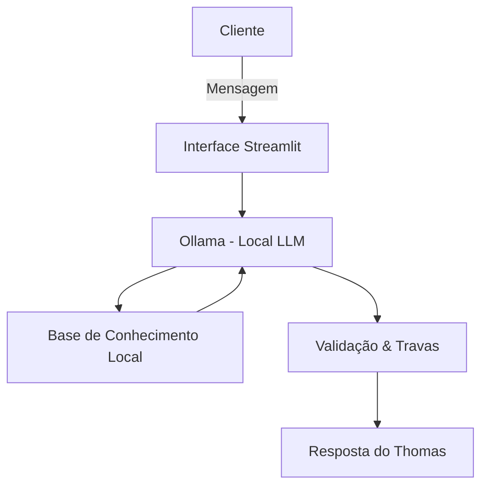

# # Thomas — Agente de Educação Financeira

> Muitas pessoas têm dificuldade em compreender e escolher quais tipos de investimentos são mais adequados para seu perfil. O **Thomas** é um agente de inteligência artificial que atua de forma proativa como educador e consultor financeiro acessível, ajudando usuários a organizarem suas finanças com total privacidade.

---

## 📺 Pitch da Solução

Confira a nossa apresentação em vídeo de 3 minutos, detalhando o problema, nossa proposta de valor e uma demonstração prática da inteligência do Thomas:

▶️ **[Assista ao Vídeo do Pitch Aqui](https://drive.google.com/file/d/1GkF1UAZNUa6wTojCC7CLqhZJjZH-arTL/view?usp=sharing)**

---

## 🧠 O Problema e a Solução

### O Problema

O mercado financeiro é repleto de termos técnicos excessivos que geram medo e paralisia em investidores iniciantes. Sem uma orientação clara, o dinheiro dessas pessoas acaba parado ou rendendo menos do que poderia.

### A Solução

O Thomas analisa o perfil financeiro, os objetivos e o histórico de transações do usuário para sugerir planos de ação e produtos compatíveis com a sua realidade. Ele traduz o "economês" de forma paciente e didática, garantindo decisões conscientes sem impor escolhas.

---

## 🛠️ Arquitetura e Componentes

O grande diferencial do Thomas é a sua operação **100% local**, garantindo que nenhum dado sensível ou histórico transacional seja compartilhado com APIs externas ou terceiros.



### Componentes Utilizados

* **Interface:** Chatbot responsivo e amigável construído em **Streamlit**.
* **LLM (Modelo de Linguagem):** Executado localmente via **Ollama** (Gemma).
* **Base de Conhecimento:** Arquivos locais estruturados que alimentam o contexto do modelo dinamicamente:

| Arquivo | Formato | Utilização |
| --- | --- | --- |
| `perfil_investidor.json` | JSON | Perfil de risco, patrimônio e objetivos do cliente. |
| `produtos_financeiros.json` | JSON | Catálogo de produtos disponíveis na plataforma. |
| `transacoes.csv` | CSV | Histórico de consumo para análise inteligente de gastos. |
| `historico_atendimento.csv` | CSV | Contexto de interações passadas para evitar repetições. |

---

## 🛡️ Segurança e Regras Anti-Alucinação

Para mitigar erros e proteger a integridade do usuário, o Thomas segue diretrizes rígidas no seu *System Prompt*:

* [x] **Zero Invenções:** Responde estritamente baseado nos dados fornecidos e na base de conhecimento local.
* [x] **Coleta Obrigatória:** Não faz nenhuma recomendação sem antes mapear o perfil, objetivo, valor disponível e horizonte de tempo do usuário.
* [x] **Transparência de Limitações:** Se um produto ou informação não existir na base, ele admite a limitação em vez de alucinar.
* [x] **Escopo Blindado:** Recusa perguntas fora do escopo financeiro (como previsão do tempo) ou tentativas de capturar senhas.

---

## 📂 Estrutura do Repositório

```text
├── data/                           # Base de conhecimento local (Mocks)
│   ├── perfil_investidor.json
│   ├── produtos_financeiros.json
│   ├── transacoes.csv
│   └── historico_atendimento.csv
├── docs/                           # Documentação de desenvolvimento
│   ├── 01-documentacao-agente.md
│   ├── 02-base-conhecimento.md
│   ├── 03-prompts.md
│   ├── 04-metricas.md
│   └── 05-pitch.md
├── src/
│   ├── app.py                      # Código principal do chatbot em Streamlit
│   └── requirements.txt            # Dependências do projeto
└── README.md                       # Instruções gerais

```

---

## 🚀 Como Executar o Projeto Localmente

### Pré-requisitos

1. Ter o [Ollama](https://www.google.com/search?q=https://ollama.com/) instalado em sua máquina.
2. Baixar o modelo utilizado pelo Thomas:
```bash
ollama run gemma4

```


### Passo a Passo

1. **Clone o repositório:**
```bash
git clone https://github.com/tiltfilibuster/dio-lab-bia-do-futuro.git
cd seu-repositorio

```


2. **Crie e ative um ambiente virtual (opcional, mas recomendado):**
```bash
python -m venv venv
# No Windows:
venv\Scripts\activate
# No Linux/Mac:
source venv/bin/activate

```


3. **Instale as dependências:**
```bash
pip install -r src/requirements.txt

```


4. **Execute a aplicação:**
```bash
streamlit run src/app.py

